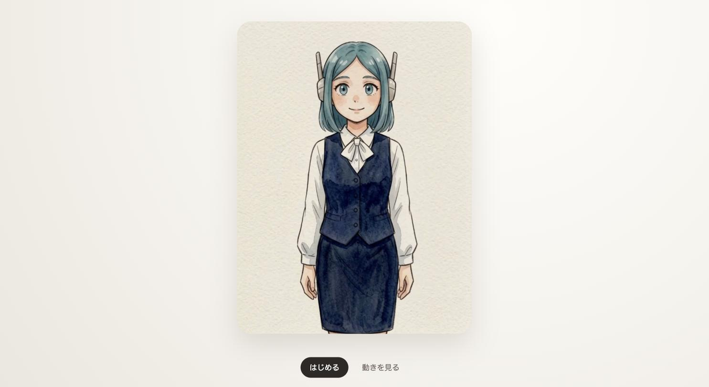
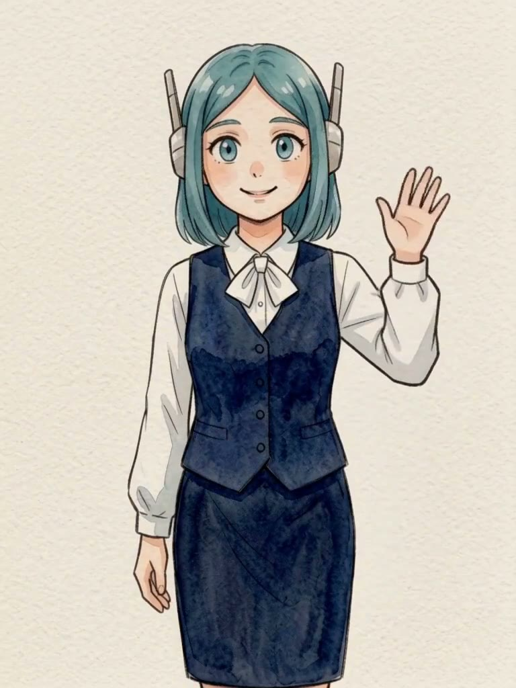
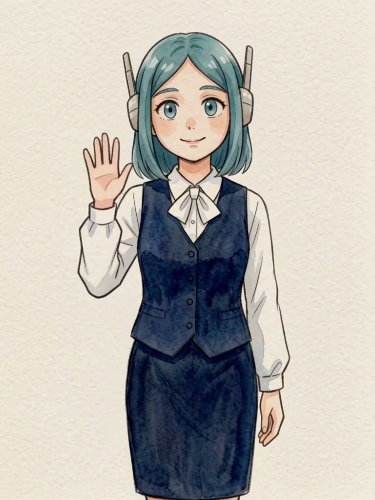
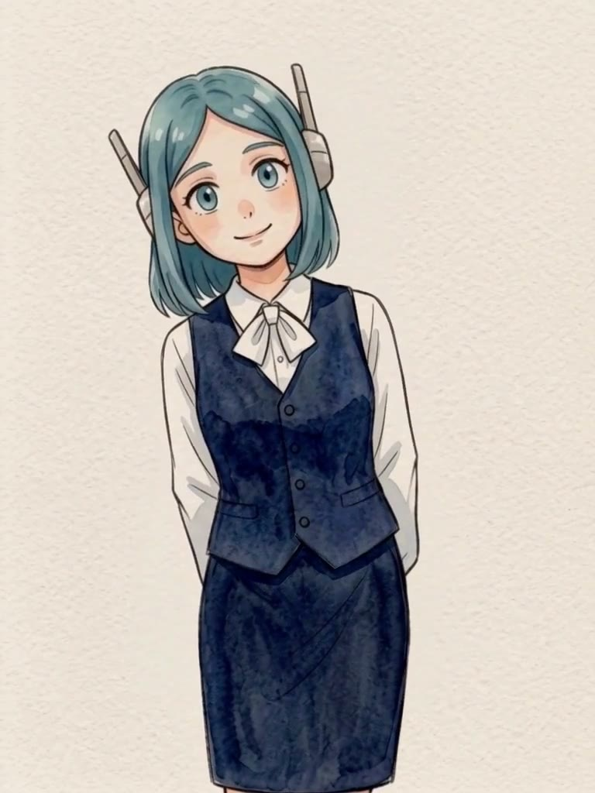

# アイコがカメラに反応する

**これは Jev（TypeSafe AI）による判定の動作検証プロジェクトです。** 本番用途のプロダクトではなく、「ローカルで検出した数値データを渡したとき、Jevがどの程度安定してジェスチャーを判定できるか」を実際に動かして確かめるためのデモです。

iPad、スマートフォン、PCのブラウザで、カメラに映った動作にアイコが動画で応えます。手・顔のランドマーク検出（MediaPipe）は端末内だけで処理し、カメラ映像自体は外部に送りません。検出した顔の角度・距離は、どのジェスチャーかの判定のために **Jev** に送っています。Jevは画像・動画を直接扱えないため（テキスト/構造化データのみ対応）、この判定専用の数値データだけを渡しています。なお手振りの左右判定は、検証の過程でJevのChoice判定が左右非対称・不安定だったため、単純な座標計算に切り替えています（詳細は`functions/api/gesture.js`のコメント参照）。Jevを使っているのは首傾げ・覗き込みの判定のみです。

検証用に立てていたCloudflare Pages/R2のデモ環境は役目を終えたため削除済みです。現在このリポジトリに公開中のライブデモURLはありません。動かし方は下記「開発」「配信」を参照してください。

> 旧版は「Jev・外部推論APIを使わない」設計でしたが、2026-09-23の要望によりJev前提に作り直しました。当時の設計判断は [20260923-aiko-camera-reactions.md](20260923-aiko-camera-reactions.md) / [20260923-aiko-camera-implementation-plan.md](20260923-aiko-camera-implementation-plan.md) に記録として残しています（現状とは異なります）。

## 画面

待機画面はこれだけです。「はじめる」でカメラ許可、「動きを見る」でカメラなしの手動プレビューが開きます。カメラ映像自体は画面に表示しません（検出用に裏で使うだけ）。



## 動作パターン

カメラの前での動きと、それに対するアイコの反応動画の対応です。判定条件は`functions/api/gesture.js`の`REACTION_CRITERIA`に対応します。

| 動き | 条件 | 反応 | 判定方法 |
| --- | --- | --- | --- |
| <br>手を振る（画面向かって左） | 手首が画面左寄りで検出される | `wave-left.mp4` | 座標計算（Jevは使わない） |
| <br>手を振る（画面向かって右） | 手首が画面右寄りで検出される | `wave-right.mp4` | 座標計算（Jevは使わない） |
| <br>首を傾げる（画面向かって左） | 両目を結ぶ線の角度がはっきり傾く | `tilt-left.mp4` | Jev（Choice）＋角度の符号で左右決定 |
| <br>首を傾げる（画面向かって右） | 両目を結ぶ線の角度が逆向きにはっきり傾く | `tilt-right.mp4` | Jev（Choice）＋角度の符号で左右決定 |
| <br>覗き込む | 顔が普段よりはっきり大きく映る（接近） | `look-into.mp4` | Jev（Choice） |

手振りの左右は、検証の過程でJevのChoice判定が左右非対称・不安定だったため座標計算に切り替えています。首傾げ・覗き込みの「種類の判定」（ノイズか意図的な動きか）はJevに任せ、左右の向きだけ角度の符号で機械的に決めています（経緯は上の説明文、実装は`functions/api/gesture.js`のコメント参照）。

## 構成

- `src/`：フロントエンド（Vite静的サイト）。MediaPipeで手・顔を検出し、直近の軌跡を同一オリジンの`/api/gesture`へ問い合わせる
- `functions/api/gesture.js`：Cloudflare Pages Function。Jev APIキーを隠す中継役。手振りは座標計算のみで即判定し、それ以外（首傾げ・覗き込み・それ以外）はJevのChoiceプリミティブに渡して判定結果を返す

フロントエンドと中継APIは同じCloudflare Pagesプロジェクトから同一オリジンで配信されるため、CORSも別ホストの管理も不要です。Jev APIキーはCloudflare Pagesの環境変数（シークレット）としてのみ存在し、ブラウザには一切渡りません。反応動画はCloudflare R2（Rangeリクエスト対応、Safari/iOSの動画再生に必須）から配信しています。

## 開発

必要なものはNode.js 20以上、ffmpeg、ffprobe、[wrangler](https://developers.cloudflare.com/workers/wrangler/)（`npm i -g wrangler` または `npx wrangler`）です。

反応動画の元ソース（`wave-left.MP4` など5本、人物が映っているため非公開）とダウンロード済みモデルは`.gitignore`対象でこのリポジトリに含まれません。`npm run assets:prepare`を動かすには、プロジェクトルートに自分で5本の素材（`wave-left.MP4` / `wave-right.MP4` / `look-into.MP4` / `tilt-to-left.MP4` / `tilt-to-right.mov`）を用意してください。見た目だけ動かしたい場合は、この手順を飛ばして`npm run models:prepare`だけ実行し、R2上の動画（本番と同じ`MEDIA_BASE_URL`）を使う形でも確認できます。

```sh
npm install
npm run assets:prepare   # 自分の素材を用意した場合のみ
npm run models:prepare
npm run build
```

ローカルで`/api/gesture`を含めて確認する場合：

```sh
cp .dev.vars.example .dev.vars   # TYPESAFE_API_KEY を設定
wrangler pages dev dist --port 8788
```

フロントエンドの見た目だけ素早く確認したい場合は `npm run dev`（Vite）でも起動できますが、その場合 `/api/gesture` は応答しません（`wrangler pages dev` 経由でのみ動きます）。

カメラを使うにはHTTPS、またはlocalhostで開いてください。iPadから直接ローカルを開く場合、`localhost` はiPad自身を指すため使えません。実機で試すには「配信」の手順で自分のCloudflareアカウントにデプロイしてください。動画だけを見る場合は初期画面の「動きを見る」を使えます。

## 検証

```sh
npm run typecheck
npm test
npm run build
npm run test:smoke
```

現在の自動検証は、キャリブレーションの状態遷移とJevへ渡すスナップショット（手の軌跡・顔の角度）の組み立て、ビルド後の配信アセットを確認します。ジェスチャーの最終判定自体はJev側で行うため、閾値の単体テストはありません。実機カメラ、GPU、権限、Safariの動画再生制限、Jevとの疎通は自動テストの代わりにならないため、[docs/device-validation.md](docs/device-validation.md) に機種ごとに記録します。

## 配信（Cloudflare Pages）

```sh
npm run build
wrangler pages secret put TYPESAFE_API_KEY --project-name aiko-jev-camera-reaction   # 初回のみ
wrangler pages deploy dist --project-name aiko-jev-camera-reaction --branch main
```

公開前に次を確認します。

- `/models/` のWASMと2つのモデルが同じ配信元から読める
- R2上の5本のMP4がH.264、音声なし、範囲リクエスト（206 Partial Content）対応で読める
- `typesafe.env.rtf`、`.dev.vars`、元動画、モデル準備用ファイルが配信物（`dist/`）にもリポジトリにも入っていない
- ブラウザから`/api/gesture`とR2以外にカメラ画像やランドマークが送られていない（`/api/gesture`へは手の軌跡・顔の角度の数値のみ、Jev APIキーはCloudflare Pages側にのみ存在）

iPadでの自動反応の実機確認結果は、機種・iPadOS・Safari・ビルドとあわせて[docs/device-validation.md](docs/device-validation.md)に記録してください。
